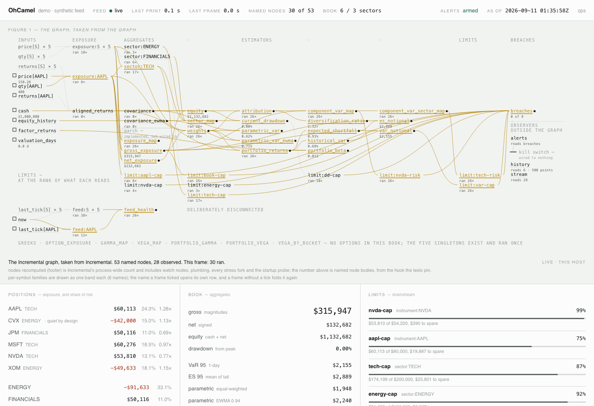
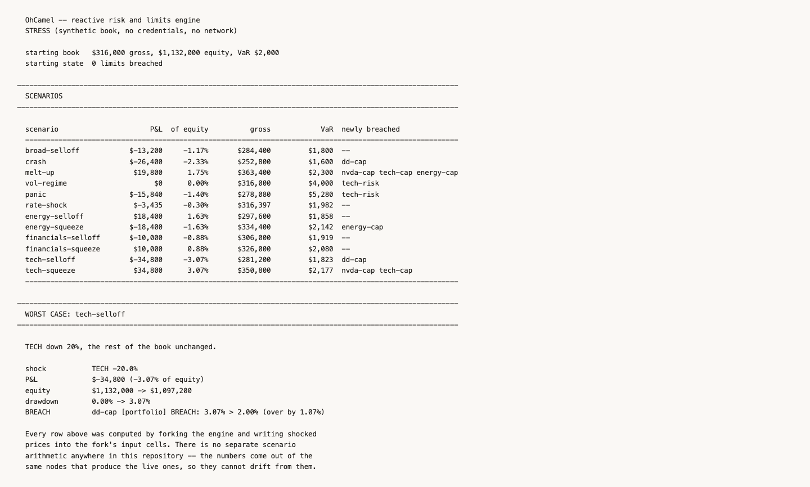
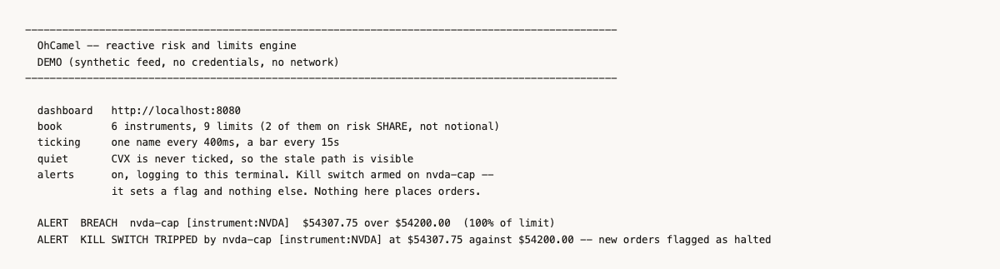

# OhCamel

[](https://github.com/ajaiupadhyaya/OhCamel/actions/workflows/ci.yml)
[](#coverage-and-what-it-is-not-measuring)

**Live:** [ohcamel.ajaiupadhyaya.com](https://ohcamel.ajaiupadhyaya.com) — the
synthetic demo, no credentials, always on. [How it is deployed](#watching-it).

A reactive risk and limits engine. Positions and market data go in; per-instrument
and per-sector exposure, gross and net, VaR, expected shortfall, portfolio beta,
drawdown and limit breaches come out — and keep coming out, updated as the market
moves rather than as a clock ticks.

It also answers the three questions a risk number invites and usually does not
get asked. **Where** is the risk: an exact Euler decomposition of portfolio VaR
across instruments and sectors, so a limit can be written against one name's
*share* of the total. **Is the number any good**: Kupiec coverage, Christoffersen
independence and the Basel traffic light, run over rolling point-in-time
forecasts. And **what would break it**: a scenario suite that shocks prices,
sectors, a macro factor or volatility itself and reports which limits move
across their line.

The math is written out once, densely and in standard notation, in
[`docs/quant_notes.md`](docs/quant_notes.md) — every formula cross-referenced to
the function that evaluates it, so a claim here can be checked against the code
without reading OCaml. This README argues; that document states.



## Why it isn't a loop

Most real-time risk systems poll. A timer fires, the process recomputes the whole
book, renders it, sleeps. That design is easy to write and it is wrong in two ways
at once. The number on screen is as old as the last tick of the *timer*, not the
last tick of the *market*, so it is always slightly stale by construction. And the
cost of an update scales with the size of the book rather than the size of the
change: one print in one name pays for an n×n covariance matrix that no price
could possibly have altered, because covariance is computed from a return window
that a mid-session print does not touch.

OhCamel does the other thing. Risk here is a dependency graph. Prices, quantities,
cash, return windows, the factor series and the current time are input cells;
everything derived from them is a node with declared edges. A tick sets one cell,
and the runtime works out what is downstream of it and recomputes exactly that.
The rest of the graph is not "recomputed and found unchanged" — it is never
visited.

`make run` prints that claim as a table. It walks a synthetic book through sixty
events, counts what Incremental actually recomputed for each one, and then asks
what the same graph would cost at three book sizes:

```
 instruments   nodes in graph     nodes per tick        if polled
------------------------------------------------------------------
          10               58               25.6               58
         100              337               25.2              337
         400             1267               26.0             1267
```

The middle column is flat and the right one is not. The cost of an event is set
by what the event touches, not by how large the book is.

### What that costs in seconds

A node count is the right proof of the *design* and it is not a proof of
anything a latency-conscious reader cares about — it says nothing about whether
a node costs a nanosecond or a millisecond. `make bench` measures the two
numbers that do, against a throwaway poll-and-recompute baseline implemented in
[`bench/bench_graph.ml`](bench/bench_graph.ml) using the *same* pure functions
the graph does, so the difference is incrementality and not one side having a
slower covariance routine.

```
  Name                 Time/Run       mWd/Run    mjWd/Run   Percentage
 ----------------- ------------- ------------- ----------- ------------
  incremental/10        19.5us         9.08kw      27.3w         0.04%
  incremental/100       89.1us        44.52kw     603.2w         0.17%
  incremental/400      492.7us       180.69kw   9_212.2w         0.92%
  polled/10             51.7us        47.94kw       9.8w         0.10%
  polled/100         3_387.7us      3_756.06kw    325.8w         6.34%
  polled/400        53_426.8us     59_345.84kw  3_948.8w       100.00%
```

Apple M2 Pro, macOS 26.5, OCaml 5.2.1, Owl's C kernels at `-O1` because of the
clang bug the Makefile documents. Run-to-run variance is 3–5% on time and
essentially zero on allocation. Numbers from your machine will differ; the
ratios should not.

At 400 names a full recompute costs **53 milliseconds**, which is not a slow
number so much as a disqualifying one: it caps the engine at about nineteen
events a second before it falls behind the market it is supposed to be watching.
The incremental path is **108× faster** and allocates **330× fewer words**.

And now the honest part, which the node-count table above hides. **The
incremental engine's cost per tick is not flat in wall-clock** — 19.5µs, 89µs,
493µs across the three sizes — even though the node count is (25.6, 25.2, 26.0).
Both are true and the second does not imply the first. A tick reaches about
twenty-five nodes at every book size, but *those* nodes are not all O(1): the
weights are O(n), the portfolio return series is O(n·w), and the Euler
decomposition is a matrix-vector product at O(n²). What incrementality buys is
that the covariance matrix — O(n²·w), the single most expensive thing here — is
not among them. The polling baseline scales as n² because it rebuilds that
matrix on every event; this one scales as the *cheap* part of n², which is why
the gap widens from 2.7× to 108× as the book grows rather than staying constant.

CI does not run this. Benchmark numbers from a shared runner are noise wearing a
lab coat, so `make bench` is a local command and the table above is a quoted run
rather than a gate.

The runtime is [Incremental](https://github.com/janestreet/incremental), Jane
Street's self-adjusting computation library, and it is the reason this is an OCaml
project. Incremental is the mature implementation of this idea and it does not
exist outside OCaml; writing one would have *been* the project rather than a
dependency of it. The rest of the language pulls its weight too — `lib/types.ml`
makes `Price`, `Qty` and `Notional` abstract and mutually incompatible, so
`price + qty` is a compile error rather than a plausible-looking number, and
Async gives the feed, the HTTP server and the staleness clock one scheduler
instead of two runtimes to reconcile.

One rule makes the whole thing work, and it is stated at the top of
[`lib/graph.ml`](lib/graph.ml):

> A node may only read its declared inputs. Reaching outside the graph for a
> value — a global, a mutable ref, a fresh API call — makes that dependency
> invisible to Incremental, which will then happily serve a stale answer because
> it has no idea anything changed. Every dependency must be an edge.

## The graph

```
  price[S] ---+
              +--> exposure[S] --+--> sector[K] --+
  qty[S]   ---+                  |                |
                                 +----------------+--> exposure_map
                                 |                +--> gross ---+---> weights
                                 |                +--> net --+  |
                                 |                           |  |
  cash --------------------------|---------------------------+--|--> equity
                                 |                              |     |
  equity_history ----------------|------------------------------|-----+--> drawdown
                                 |                              |
  returns[S] --> aligned_returns +--> covariance                |
                         |       +--> covariance_ewma          |
                         |                      \             /
                         +----------------------+-> portfolio_returns
                                                 \      |
                                                  \     +--> historical_var --> var_notional
                                                   \    +--> expected_shortfall --> es_notional
                                                    +------> parametric_var
                                                    +------> parametric_var_ewma
                                                         |
  factor_returns ----------------------------------------+--> portfolio_beta
                                                                     |
  (each limit reads exactly one of the nodes above) --> limit[name] -+--> breaches

  -- the decomposition, which reads the same two inputs as parametric_var --

  weights ------+
                +--> attribution --+--> component_var[S] --+--> component_var[K]
  covariance ---+                  +--> diversification_ratio

  -- options: delta folds INTO exposure[S] above; convexity cannot --

  contracts[o] --+
  implied_vol[o] +--> greeks[o] --+--> delta_equivalent[o] --> (exposure[S])
  price[S] ------+                +--> gamma[S] --> portfolio_gamma
  valuation_days +                +--> vega[S]  --> portfolio_vega
  rate ----------+

  -- and, deliberately disconnected from everything above --

  last_tick[S] --+
                 +--> feed[S] --> feed_health
  now -----------+
```

The two `covariance` rows are siblings: the same matrix under flat and under
exponentially decaying weights, hanging off the same edge, each feeding its own
parametric VaR. They are stacked rather than drawn separately because their
dependency structure is identical, which is the whole reason the comparison
between them means something.

Three edges in that picture are the argument for the architecture.

`covariance` hangs off `aligned_returns` and nothing else. It is the most
expensive thing this engine computes, and a price tick does not reach it. In a
poll-and-recompute design it would be rebuilt on every pass, for nothing.
`covariance_ewma` is its sibling on the same edge, so the engine now computes
that most expensive thing *twice* — and the table above prices that decision
exactly: **two more nodes in the graph, and one more node per tick**, at every
book size. Not two more per tick. Neither matrix is downstream of price, so what
a tick pays for is a second matrix-vector product, never a second matrix rebuild.
An estimator costs what its inputs cost, and its inputs move once a day.

Each limit is its own node hanging off the single quantity it measures, so an
instrument-scoped limit on AAPL is downstream of `exposure[AAPL]` alone and a tick
in an unrelated name leaves it strictly untouched.

The options branch has a clock of its own, and it is a *different* clock. `now`
below drives feed staleness and ticks every few seconds; `valuation_days` drives
theta and moves only when a caller advances it. Two cells because there are two
questions, ticking three orders of magnitude apart — see
[Where the risk is when it isn't linear](#where-the-risk-is-when-it-isnt-linear).

The feed-health branch is a dead end on purpose. `now` is advanced by a timer, and
if any risk node were downstream of it that timer would recompute the book on a
schedule — which is the design this project exists to replace. Staleness is
time-dependent and has to be; the discipline is that nothing else may be. Note the
asymmetry: `feed[S]` depends on `last_tick[S]` and never on `price[S]`, so the two
branches share an event but not an edge.

`test/test_graph.ml` asserts all three as recomputation counts, which makes the
architectural premise an executable claim rather than a comment.

## Where the risk is

A portfolio VaR of $12,000 is a fact about the book and not an instruction. It
does not say what to sell, and the obvious way of finding out — sort the
positions by size — answers a different question. Money and risk are not the
same distribution.

Portfolio volatility is homogeneous of degree one in the weights, so Euler's
theorem splits it exactly:

```
sigma_p = sum_i w_i * d(sigma_p)/d(w_i)
```

No approximation, no residual. Each term is one instrument's *contribution*, and
because the split is exact the terms sum over any partition of the book — a
sector, a strategy, a desk — and the parts still add to the whole. Parametric VaR
is a constant multiple of `sigma_p`, so the same split carries into VaR units and
the component VaRs sum to the portfolio's. `make run` prints it:

```
  symbol       of money  component VaR      of risk risk/money
  --------------------------------------------------------------
  AAPL            18.5%           $429        18.8%      1.02x
  CVX             18.5%           $619        27.1%      1.47x
  JPM             10.3%            $88         3.9%      0.38x
  MSFT            20.7%           $337        14.8%      0.71x
  NVDA            17.9%           $522        22.9%      1.28x
  XOM             14.0%           $285        12.5%      0.90x
  --------------------------------------------------------------
  total          100.0%         $2,281       100.0%
  ENERGY                          $904        39.6%
  FINANCIALS                       $88         3.9%
  TECH                          $1,288        56.5%
```

CVX and AAPL are the same size and CVX carries half as much risk again. JPM is a
tenth of the money and a twenty-fifth of the risk. Nothing in the exposure table
says either of those things.

This is what makes an instrument-scoped VaR limit well posed, and it retires a
restriction the code used to state and enforce. `Limits.scope_is_valid` still
rejects a `Value_at_risk` limit on one name, and correctly: two names each with
$10,000 of standalone VaR do not carry $20,000 together unless they are perfectly
correlated, so summing standalone quantiles over-counts the book's risk by
exactly the diversification between its parts. A `Component_var` limit is
accepted at every scope, because the shares are additive by construction. You
*can* put a VaR limit on one name — it has to be the share, not a standalone
quantile, and the two are different numbers.

That limit behaves differently from a notional cap in a way worth internalising
before writing one: it is correlation-aware, so a name's number moves when
*other* positions move. Adding a hedge can bring a name back inside its component
limit without trading that name at all. And a contribution can be **negative** —
a position that moves against the book reduces portfolio volatility — so a hedge
consumes none of its risk limit however large it is. `test_graph.ml` asserts that
directly, because a stray `abs` anywhere in the chain would breach a risk limit
for the act of hedging.

Two honest limits. The decomposition is the *Gaussian* one: it needs a
differentiable closed form for portfolio risk, and only the covariance path has
one. Historical VaR is an order statistic of the sample — its derivative with
respect to a weight is zero almost everywhere — and the kernel-smoothed
alternatives are too noisy at these sample sizes to be worth trading against. So
this says how risk is *shared out*, which is a question about correlation
structure and is fairly robust, rather than how large the tail *is*, which is
what normality gets wrong. Read it beside the historical number, not instead of
it. And this branch *is* downstream of price — weights move on every tick — so
unlike `covariance` it recomputes constantly. What it costs is a matrix-vector
product against the matrix rebuild a polling design would do.

Alongside it, the diversification ratio: standalone risks summed, over portfolio
risk, so at least 1.0. The synthetic book runs about 2.5, meaning it carries
around 40% of the volatility its positions would if they all moved together. It
is the number that collapses toward 1.0 in a crisis, because correlations going
to one is what a crisis mechanically *is*.

## Where the risk is when it isn't linear

Everything above measures risk in one dimension. An equity position's exposure
is price times quantity, its P&L moves linearly with the price, and a covariance
matrix over returns says most of what there is to say. None of that survives
contact with an option. A position can be flat in the underlying and still lose
money on a move in either direction, or lose money on no move at all, or lose
money because the market changed its mind about how much the underlying *will*
move without the underlying moving.

`make options` is that argument as a program. Short 50 NVDA 950-strike calls,
30 days out, spot $900:

```
                      delta-equiv          gamma    vega / vol pt
  ----------------------------------------------------------------
  options only        $-1,204,067          -23.7          $-4,246
  + the hedge                  $0          -23.7          $-4,246
  ----------------------------------------------------------------
```

The hedge is 1,338 shares and the engine computed the ratio — it is the option
leg's delta-equivalent exposure over the spot. Delta goes to exactly zero.
Gamma and vega do not move at all, because a share is linear in its own price
and contributes precisely none of either. That is the entire content of the
phrase *first-order hedge*, and it is why the limits then read:

```
  BREACH  141.5%  nvda-vega       $424,637 > $300,000
  ok        5.9%  nvda-gamma      $23.72 <= $400.00
  ok        0.0%  nvda-notional   $0.00 <= $1,000,000.00
```

The notional cap is clear because the book *is* delta flat. The vega cap is not,
because it never was. An engine that measured only exposure would report this
book as carrying no risk at all.

### Delta folds in; convexity cannot

An option's **delta-equivalent exposure** — `delta × multiplier × contracts ×
spot` — is added into the *same* `exposure[S]` node the shares produce. Not
alongside it, into it. Gross, net, the sector totals, the weights, equity,
drawdown and every `Gross_notional` limit at every scope are already functions
of that node, so all of them account for options without a line of change and,
far more importantly, without a second definition of what "exposure" means. A
parallel options-exposure system would be exactly the duplication `stress.ml`
goes to some length to avoid having.

Gamma and vega deliberately do **not** fold in anywhere. Delta-equivalent
exposure is a first-order statement — "this behaves like N dollars of the
underlying for a small move" — and gamma is precisely the statement that it
stops being true for a large one. There is no honest way to express convexity as
a quantity of underlying, so they get their own nodes rather than a fabricated
column in a linear sum.

`Contracts.t` is a distinct type from `Qty.t`, which is the units discipline
earning its keep at the one place it bites hardest: one contract is a hundred
shares, so a book holding "50" of something holds either 50 shares of delta or
5,000 depending on which type that 50 is, and both readings produce a plausible
exposure. The multiplier has to be applied explicitly, in one function.

### Two clocks, and why they are not one

Theta is genuinely time-dependent, which is a problem, because the one thing
this architecture cannot have is a risk node downstream of a running clock. The
staleness branch is a dead end on purpose — `now` advances every few seconds,
and anything hanging off it would recompute the book on a timer.

So options get a **second clock**: a valuation-date cell that moves in days and
only when a caller advances it. Two clocks because there are two questions, and
they tick three orders of magnitude apart — a contract's value changes
immeasurably over five seconds and materially overnight. Wiring the Greeks to
the staleness timer would have bought a decay invisible below a day at the cost
of putting the entire options book on a five-second schedule.
`test_options_graph.ml` asserts both directions: advancing the staleness clock
recomputes no Greek, and advancing the valuation clock touches nothing about
feed liveness.

Advancing it twenty days shows something worth staring at:

```
                      delta-equiv          gamma    vega / vol pt
  ----------------------------------------------------------------
  today                        $0          -23.7          $-4,246
  +20 days               $657,690          -25.2          $-1,502
  ----------------------------------------------------------------
```

Nothing was traded. The share count is identical. The book is no longer delta
flat, because the contract decayed further out of the money, its delta fell, and
the hedge that offset it exactly now over-hedges by $657,690. A delta hedge is
correct at an instant and stale immediately afterwards — which is why the number
hangs off an edge instead of being stored.

### Greek limits, and one caveat that the arithmetic hides

`Greek_limit` caps `|gamma|` or `|vega|` and is valid at **every** scope, for a
reason worth separating from `Component_var`'s. Gamma and vega are sums of
derivatives, not quantiles: the book's gamma is the derivative of a sum, which
*is* the sum of the derivatives, exactly and by linearity, with no correlation
term and no diversification to double-count. That is precisely what fails for
`Value_at_risk` — a quantile of a sum is not the sum of quantiles.

Note the sign conventions differ, and each is argued where it is defined. A
Greek limit takes the **magnitude**: a short option book has negative gamma, and
being short convexity is the dangerous side, not the safe one. `Component_var`
keeps the **sign**: a negative contribution there means a position is reducing
portfolio risk, so absolute-valuing it would breach a limit for hedging.

The caveat is real, and rather than describe it the engine now shows it.

Summing vega across contracts at *different expiries* adds sensitivities to
different volatilities — the 25-day implied and the 180-day implied move
together but not identically — so a single portfolio vega treats the whole term
structure as one number shifting in parallel. Every desk does this and calls it
parallel-shift vega. The case it gets badly wrong is the **calendar spread**,
and `make options` builds one:

```
  long     50 NVDA 950 calls, 180 days out
  short   170 NVDA 950 calls, 25 days out

  portfolio vega                      $0   <- the parallel-shift number
  portfolio gamma                  -72.5

  by tenor bucket:
    1w-1m                       $-12,559
    3-6m                         $12,559
```

The total is zero and the book is not flat. It is short near-dated volatility
and long far-dated volatility in equal parallel-shift size — a bet that the term
structure steepens, with real P&L, which one vega number reports as nothing at
all. The gamma of −72.5 is a second exposure the same number is silent about.

Bucketing does not make the sum exact: vega inside a bucket is still added
across the expiries within it. What it does is make the thing being approximated
visible, which is the difference between an approximation and a blind spot. The
buckets are cut on days *remaining*, so a position slides from one to the next
as the valuation clock advances with nothing traded — which is why `graph.ml`
hangs the bucketing off that clock rather than assigning a bucket once at
construction, a choice that would look correct for about a month.
`test_options_graph.ml` walks a contract from 3-6m to 1-3m to ≤1w to expired by
advancing the clock alone.

### What the options path does not do

No implied-volatility solve. Inverting Black-Scholes for sigma needs a market
price to invert *from*, and there is no options-chain source here, so it would
be the second half of a bridge to nowhere. Implied vol is an input.

No American exercise, no dividends, no term structure of rates — Black-Scholes
with one flat rate and one vol per contract. Each is a real simplification and
each is named rather than left to be discovered. Vega is bucketed by tenor but
not by strike, so a book long the wings and short the body reads flat within a
bucket the way a calendar spread used to read flat across them; a skew
decomposition is the same idea one axis over, and is not here.

And **live mode ships options risk disabled**, with a line saying so. Greeks need
an implied vol per contract, Alpaca's free tier does not provide an options
chain, and the alternatives were to decline or to invent a surface. An invented
surface would produce a full set of Greeks, a portfolio vega and a vega limit
that all looked exactly like the real thing — the same failure as a book marked
at a plausible default price, and worse than no number because nothing on the
page would say it was fiction. `make options` runs the whole path against a
smiled surface that is labelled synthetic in every line it appears in.

## Is the number any good

"95% VaR" is a testable claim with precise content: the realised loss should
exceed it on about 5% of days, and those exceedances should be scattered rather
than bunched. An engine that reports the number and never checks the claim is
asserting something it has no evidence for, and the failure is silent — an
uncalibrated VaR looks exactly like a calibrated one until the day it matters.

`make backtest` is the check. Three deterministic return series, three
estimators, nine verdicts:

```
 series       estimator         n  excepts  expected  Kupiec p   indep p   joint p      duration p  Basel   verdict
 ---------------------------------------------------------------------------------------------------------------------
 iid-normal   historical      940       45      47.0    0.7631    0.3595    0.6280  0.6291 b= 0.95  green   ok
 iid-normal   parametric      940       48      47.0    0.8814    0.0229    0.0744  0.8975 b= 1.01  green   ok
 iid-normal   ewma(0.94)      940       54      47.0    0.3057    0.0102    0.0219  0.0577 b= 1.24  green   REJECTED
 vol-regime   historical      940       52      47.0    0.4616    0.9405    0.7605  0.9438 b= 0.99  green   ok
 vol-regime   parametric      940       65      47.0    0.0107    0.8028    0.0373  0.9592 b= 1.00  yellow  REJECTED
 vol-regime   ewma(0.94)      940       59      47.0    0.0836    0.6864    0.2063  0.2446 b= 1.13  yellow  ok
 jumps        historical      940        0      47.0    0.0000    1.0000    0.0000        --        green   REJECTED
 jumps        parametric      940       47      47.0    1.0000    0.0277    0.0886  0.0000 b=20.00  green   ok
 jumps        ewma(0.94)      940       47      47.0    1.0000    0.0277    0.0886  0.0000 b=20.00  green   ok
```

**Four** statistics, because a model can fail in more ways than one test can
tell apart — and the fourth was added because the first three were caught
missing something. Start with the three. **Kupiec**'s proportion-of-failures test asks whether
there are the right *number* of exceedances, and it is two-sided — too few is a
rejection too, because a VaR that is never breached is not measuring the quantile
it claims to and every limit written against it is slack by an unknown amount.
**Christoffersen**'s test asks whether the exceedances are *independent*: a model
can be breached exactly 5% of the time and still be useless if they all land in
one week, which is the signature of a model that is not tracking volatility.
**Conditional coverage** is the joint test, reported next to its components
rather than instead of them, because a joint rejection says the model is wrong
and the parts say which half.

And then **duration** — Christoffersen and Pelletier's test, which asks the
independence question a different way and catches what the Markov one cannot.
Under correct conditional coverage the *waiting times between* exceedances are
memoryless: how long you have waited says nothing about how much longer you
will. So fit a Weibull to those durations, whose shape parameter $b$ collapses
to the exponential exactly at $b = 1$, and test the restriction. $b < 1$ means a
breach makes the next one arrive sooner than chance — clustering. $b > 1$ means
breaches are *more regular* than chance. Because it works on durations rather
than on adjacency, a burst landing every third day is as visible as one landing
on consecutive days.

It is reported beside the joint verdict and deliberately **not folded into it**.
Conditional coverage is Kupiec plus the *first-order* independence test, and its
two degrees of freedom follow from exactly those two pieces; adding a third
statistic to that sum would produce something with no distribution anyone has
derived, and would silently change the meaning of every verdict this suite has
already published.

The whole analysis turns on one discipline, and it is enforced structurally
rather than by care. `Var_backtest.rolling` hands the estimator
`returns[t-w .. t-1]` and scores it against `returns[t]` — the day being
forecast is not in the array the estimator receives, so it cannot be reached. A
VaR estimated from a window that includes the day it is predicting looks superb
and means nothing, and the output gives no sign. `test_var_backtest.ml` asserts
the slicing directly against independently-built windows.

Two rows of that table are worth reading rather than skimming.

The `jumps`/historical row reports **zero exceptions in 940 days**, a Kupiec
p-value that rounds to zero, and a **Basel zone of green**. That is not an
inconsistency. Basel's traffic light is one-sided by design — it asks whether a
bank is *understating* risk, because that is the direction that threatens
solvency — while a coverage test is two-sided. A model can be comprehensively
wrong and still be green. The zone is a supervisor's tolerance, not a verdict.
(The zones are computed from the binomial rather than looked up, and reproduce
the published 250-day table exactly: green 0–4, yellow 5–9, red 10+. That is
asserted as a test.)

And `iid-normal`/parametric shows an independence p-value of 0.023, on data that
is independent by construction — a 5% test doing what a 5% test does one time in
twenty. It is the argument for gating on the joint statistic rather than on
whichever component looks worst, which is multiple testing wearing a lab coat.

### The row where the fourth test earns its place

Look at `jumps`/parametric. That series is quiet days with an identical −8% loss
**every twentieth day**, so exactly 5% of days are the tail. Kupiec is perfect:
47 exceptions against 47 expected, p = 1.0000. The Markov independence test
gives 0.028. The joint verdict is 0.089 — **not rejected**. Basel is green.
Three statistics, and the model passes.

The duration test rejects it at **p < 0.0001**, with the fitted shape pinned at
the search's upper bound of 20.

It is right to. A tail that arrives every twentieth day without fail is not a
market — it is a metronome, and the waiting times have *zero variance*, which is
as far from memoryless as a sample can get. The Weibull likelihood is increasing
in $b$ without limit there, so the reported 20.00 is a bound rather than a fit
and the code says so. Nothing else in the battery could see it: the count was
right, and no two breaches were ever adjacent.

The mirror case is one row up. `jumps`/historical reports **zero** exceptions, so
there are fewer than two durations to fit anything to and the column reads `--`.
That is "the test does not apply", which is a different statement from "no
evidence of clustering" and is printed differently on purpose.

### What the third estimator bought, and what it cost

The `parametric` and `ewma(0.94)` rows are the same closed-form VaR over the
same window, differing only in how quickly the past stops counting. Any
difference in verdict between them is therefore a statement about *weighting*
and about nothing else, which is why they are computed as siblings rather than
one replacing the other. Two rows moved, in opposite directions.

On `vol-regime` — calm for 600 days, then four times as volatile — the
equal-weighted estimator is **rejected** (65 exceptions against 47 expected,
joint p = 0.037) and the EWMA one is **not** (59 exceptions, joint p = 0.206).
That is the failure the README has admitted to since the first version, fixed,
and it is fixed in the specific way the theory predicts: Kupiec moves, because
the number of breaches was the problem, while independence was never rejected
for either. An equal-weighted sixty-day window does not mistime its breaches
during a regime shift; it simply runs too small a number for sixty days.

On `iid-normal` the trade runs the other way. EWMA is **rejected** (joint
p = 0.022) where equal weighting passes, and the component that rejects it is
independence, at p = 0.010. This is not a bug and it is worth stating plainly:
at λ = 0.94 the effective sample size is about 31 observations against the flat
window's 60, so on data with no regime to track, the estimator is paying its
whole variance cost for nothing and chasing noise it should be averaging away.
Responsiveness is not free. It is bought with estimator variance, and this table
is what the receipt looks like.

Which is why neither estimator is the default and both are on the dashboard.
Their **ratio** carries information neither number does: EWMA above
equal-weighted means volatility is rising faster than the flat window has
absorbed, and EWMA below it means a shock is ageing out of that window which the
market has already stopped pricing. That second case is the one nobody expects —
reported risk falling by a third overnight because a crash day left a
sixty-observation window, an event in the *estimator* that looks exactly like an
event in the market.

The joint verdict rejects three of nine configurations, and the duration test
rejects two more that it passed. Two of those five are cases where one estimator
passes and another fails on *identical* data. That is the point. A validation
battery that has never failed anything is not evidence of anything; one where
every estimator agrees is not telling you which to use; and one where every
statistic agrees is not telling you what it cannot see.

### The estimator that is implemented and deliberately not used

GARCH(1,1) is the obvious next step after EWMA. It adds the one thing EWMA has
no notion of — **mean reversion**. With a single hand-set decay factor there is
no long-run level to revert to; GARCH has one, and `alpha + beta`, the
*persistence*, says how much of a volatility shock survives each period and
therefore what its half-life is. That number is the entire reason to prefer it.

It is implemented in [`lib/vol_estimators.ml`](lib/vol_estimators.ml), fitted by
maximum likelihood with Engle variance targeting, and tested against a process
it recovers correctly. It is **not wired into the graph**, and `make garch` is
the measurement that says why:

```
         n   alpha (mean +/- sd)    beta (mean +/- sd)     persistence (mean +/- sd)
  --------------------------------------------------------------------------------
        60     0.112 +/- 0.104         0.444 +/- 0.375         0.556 +/- 0.364
       125     0.097 +/- 0.093         0.607 +/- 0.346         0.704 +/- 0.334
       250     0.099 +/- 0.047         0.841 +/- 0.108         0.939 +/- 0.102
       500     0.098 +/- 0.034         0.859 +/- 0.049         0.957 +/- 0.032
      1000     0.092 +/- 0.019         0.880 +/- 0.023         0.973 +/- 0.012
      2000     0.103 +/- 0.014         0.872 +/- 0.015         0.975 +/- 0.009
```

Simulate a known process — `alpha = 0.10`, `beta = 0.88`, persistence 0.98, a
34-day shock half-life — fit it back, thirty replications at each length. Fixed
seed, so the table is the same on any machine.

**This engine's return window is 60 observations.** At 60 the persistence comes
back at **0.556 ± 0.364** against a true 0.98. Read both numbers: the standard
deviation is roughly the size of the thing being estimated, so one fit carries
almost no information — and the mean is *biased*, not merely noisy. Sixty
observations do not contain enough evidence of a long memory to distinguish it
from a short one, so the fit systematically understates persistence. A model
that cannot tell a 34-day half-life from a 2-day one is not reporting a
half-life.

The row where it becomes defensible is `n = 250` and up — a year of daily data,
which is what a GARCH deserves. So the engine ships equal-weighted and EWMA,
both *parameterised* rather than fitted, and therefore with no sampling
distribution to be wrong about at this window length.

It seemed worth building the thing in order to find that out, and worth keeping
it so the finding is reproducible rather than asserted. An absence that has been
measured is a different claim from an absence that has not.

## The same battery, real crises

Everything above is scored against series whose regime was chosen by the person
writing the test. That is the right way to *build* a coverage battery — it is
the only setting where you know in advance which tests ought to reject — and it
is not evidence that the model survives a real tail. Synthetic tail events are
drawn from the distribution the author had in mind. Real ones are not, and the
gap between those two sentences is most of what goes wrong with risk models.

`make backtest-crisis` changes exactly one thing: the data. Same 60-day window,
same 95%, same three estimators, same `Var_backtest.rolling`. The method has to
be visibly identical or the comparison says nothing.

Three windows, each the crisis plus enough either side that the rolling window
has something to warm up on — two sharp shocks and one slow grind, because a
model that fails in a volatility *jump* is failing for a different reason than
one that fails in a year-long drawdown, and running only jumps would hide the
difference:

| window | span | sessions | the book's worst day |
|---|---|---|---|
| `gfc` | 2007-07 → 2009-12 | 631 | −7.02% |
| `covid` | 2019-06 → 2020-12 | 400 | −7.07% |
| `rates-2022` | 2021-06 → 2022-12 | 401 | −3.81% |

The book is the same six names `make run` uses — long tech and financials,
short energy — held at constant weights across each window. That is graph.ml's
own documented approximation, and it is the question a limit is actually
asking: what would *today's* book have done through this history.

```
 window       estimator         n  excepts  expected  Kupiec p   indep p   joint p      duration p  burst  Basel   verdict
 -------------------------------------------------------------------------------------------------------------------------
 gfc          historical      570       25      28.5    0.4925    0.9207    0.7862  0.7483 b= 0.95      5  green   ok
 gfc          parametric      570       27      28.5    0.7713    0.5347    0.7906  0.2265 b= 0.84      5  green   ok
 gfc          ewma(0.94)      570       34      28.5    0.3043    0.9811    0.5899  0.2243 b= 1.20      5  green   ok
 covid        historical      339       18      17.0    0.7955    0.0699    0.1870  0.0160 b= 0.66      8  green   ok
 covid        parametric      339       22      17.0    0.2279    0.0521    0.0733  0.0033 b= 0.65     10  green   ok
 covid        ewma(0.94)      339       23      17.0    0.1517    0.2659    0.1928  0.3409 b= 0.86      5  green   ok
 rates-2022   historical      340       24      17.0    0.1000    0.8083    0.2511  0.7096 b= 1.06      4  yellow  ok
 rates-2022   parametric      340       22      17.0    0.2330    0.6877    0.4530  0.5292 b= 1.11      4  green   ok
 rates-2022   ewma(0.94)      340       22      17.0    0.2330    0.6877    0.4530  0.2816 b= 1.21      4  green   ok
```

**The joint verdict rejects nothing.** Not the global financial crisis, not
COVID, not 2022. The duration column rejects two rows, and the gap between those
two facts is what this section is about.

### Why the model survived, and why that is not reassuring

Part of it is real. This book is genuinely hedged — long technology and
financials against a short energy leg — and in the second half of 2008 energy
fell harder than technology did, so the short side paid on the worst days. The
book's daily volatility through the GFC window is 1.6%, rising to 2.5% in the
Lehman quarter. That is a 1.5× regime change, not the 4× one the synthetic
`vol-regime` series inflicts, and a 60-day window absorbs 1.5× tolerably.

The rest of it is the tests not seeing what is in front of them, and this window
is what put a fourth statistic in the battery.

On the GFC window this book takes **five exceptions between 15 September and 7
October 2008** — seventeen sessions spanning Lehman and the TARP vote — and
Christoffersen's independence statistic returns **p = 0.92**. The test is not
broken and it is not lying. It is a first-order Markov test: it compares
P(exception | exception yesterday) against P(exception | no exception
yesterday), so it detects exceedances arriving *back to back*. Across that
entire 570-day series exactly one pair falls on adjacent days. A burst that
lands every third session is invisible to it, and a reader who takes "p = 0.92"
to mean "the exceedances were well scattered" has read something the statistic
never said.

COVID is worse. `covid`/`parametric` takes **10 exceptions in a single
21-session window** — ten times the independent expectation — with a joint
p-value of 0.073, which does not reject at 5%. A model breaching its 95% VaR ten
times in a month is not a calibrated model.

**The duration test says so: p = 0.0033, shape 0.65.** A shape well below 1 is a
decreasing hazard — a breach makes the next one arrive sooner than chance, which
is the definition of clustering — and because the statistic works on waiting
times rather than on adjacency, the three-day spacing that hid the cluster from
the Markov test does not hide it here. `covid`/`historical` rejects too, at
0.016 with a shape of 0.66.

**And it still does not catch the GFC**, at p = 0.75 with a shape of 0.95. That
is not a defect being glossed over; it is what the test is. It is a **global**
fit over the whole duration distribution, and twenty-five durations spread
across 570 days still look roughly exponential in aggregate even with five of
them bunched around Lehman. One local burst inside a long calm series barely
moves it.

Which is why the `burst` column stays. It is not a hypothesis test and is
labelled as such — just the most exceptions any 21 consecutive sessions
contained, against roughly 1.1 expected under independence — and it is the only
one of the three that sees a *local* cluster. Three instruments, three different
blind spots: adjacency, aggregation, and no distribution theory at all. Reading
one of them alone is how a model breaching ten times in a month gets a passing
grade.

### What EWMA bought here

The clearest thing in the table, and now visible three independent ways at once.
On the COVID window the EWMA estimator cuts the worst burst from **10 to 5**,
moves the Markov independence p-value from 0.052 to 0.266, and moves the
duration p-value from **0.0033 to 0.34** — from a decisive rejection to nowhere
near one, with the fitted shape rising from 0.65 to 0.86. Three statistics that
fail in different ways all agree: it is tracking the volatility spike the flat
window is still averaging away, which is exactly the failure the EWMA estimator
was added for, showing up on data nobody constructed.

It is not free, and the same table says so: on the GFC window EWMA takes **34
exceptions against 27** for equal weighting, on a window where the regime
change was mild enough that the flat estimator was already adequate. That is
the estimator-variance cost the synthetic `iid-normal` row priced, appearing
again on real data. Responsiveness where there is nothing to respond to is
noise, and the reason both estimators are on the dashboard is that neither
dominates.

### Where the data comes from

`docs/crisis/*.csv` — adjusted daily closes, committed to the repository, so
this table reproduces with no API key, no network and no Python. Adjusted, not
raw: an unadjusted 2-for-1 split reads as a −50% single-day return and *becomes*
the entire tail of a 60-day window at 95% confidence, and four of these six
names split inside these windows or since.

The cache is populated by [`tools/fetch_crisis_data.py`](tools/fetch_crisis_data.py),
which is a script and not part of the library because it runs once and the
engine never calls it. If the cache is missing, `make backtest-crisis` fails
with the command that rebuilds it and **does not** fall back to the synthetic
series — a crisis backtest quietly scoring generated data would print a table
indistinguishable from this one under a heading claiming otherwise.

One honest note about provenance. The obvious source was Alpaca, which this
project already speaks to and which the roadmap for this work originally
specified. Alpaca's historical stock bars begin in **2016**, so the 2008 window
is unreachable through it at any subscription tier — the constraint was checked
rather than assumed. The data here comes from Yahoo's public chart endpoint
instead, which is keyless and unofficial: there is no contract and no guarantee
it still exists next year. That is precisely why the output is cached and
committed rather than fetched on demand. The reproducibility of this table does
not depend on that endpoint, only its provenance does.

## What would break it

Every other number here is backward-looking by construction. VaR summarises a
distribution that has already been observed; a limit compares today's exposure to
a line. Both share a blind spot that is not a flaw in the estimator but a
property of the question — they can only speak about moves that have already
happened somewhere in the return window.

A scenario asks the other question. `make stress`:



Four of the five shock kinds move prices, and those compose additively, so a
scenario reads as a sentence: a market move, plus a sector move, plus an
idiosyncratic one. The fifth, `Volatility`, scales the return window instead and
therefore multiplies. `Factor` is the one that
earns its keep — the macro factor moves, and each name responds through *its own*
beta to it, estimated from the return windows the engine already holds. A rate
shock does not hit every name equally, which is the entire reason to express it
as a factor move rather than a price move. Names whose beta cannot be estimated
do not move, and are *named in the output*: "this name did not move" and "this
name could not be moved" look identical in a P&L table and mean opposite things.

The two rows that carry the argument are `vol-regime` and `crash`. `vol-regime`
shocks nothing but volatility: P&L is exactly zero, gross is unchanged, every
notional cap sits exactly where it did — and it breaks a component-VaR limit.
`crash` moves every price 20% and breaks the drawdown limit and nothing else.

A price shock moves what the book is *worth*; a volatility shock moves what it is
*expected to do*. Keeping the two
separate is what stops a scenario from quietly answering a question nobody asked
— and it is why shocking prices deliberately leaves the VaR *fraction* alone. A
hypothetical move today is not in the return window and is not evidence about the
distribution. The dollar VaR does move, because gross did.

There is no scenario arithmetic anywhere in this repository, and that is the
design decision in this module. The obvious implementation multiplies positions
by shocked prices and re-checks the limits — a second implementation of exposure,
equity, drawdown and every limit rule, living next to the first and drifting from
it the first time someone changes a convention in one and not the other. Instead
`Graph.fork` copies the engine, the shocks are written into the fork's input
cells, and the answer is read out by exactly the nodes that produce the live one.
The scenario is not a model of the engine; it is the engine, fed different
inputs. `test_stress.ml` runs the entire suite and then asserts the live
snapshot is unchanged field for field — a fork that shared an input cell with its
parent would produce numbers that were still internally consistent and were about
a world that never happened.

## The modules

[`lib/graph.ml`](lib/graph.ml) is the engine: every input cell, every derived
node, and a comment on each one explaining *why* it depends on what it depends on.
[`lib/risk_metrics.ml`](lib/risk_metrics.ml) holds the numerics as ordinary
functions — historical and parametric VaR, expected shortfall, covariance, beta,
portfolio standard deviation through Owl and BLAS — none of which know Incremental
exists, so each can be unit-tested against a hand-computed value.
[`lib/vol_estimators.ml`](lib/vol_estimators.ml) is the same contract for the
decay-weighted estimators, and it is a separate module rather than more functions
in the first one because the two are *alternatives to each other*: keeping them
apart is what makes "which estimator produced this number" a question with a
one-word answer.
[`lib/options.ml`](lib/options.ml) is Black-Scholes and the Greeks, plus the
contract types — `Strike`, `Implied_vol`, `Contracts` — that keep a contract
count from ever being mistaken for a share count.
[`lib/limits.ml`](lib/limits.ml) defines limits and evaluates a breach as *data*: a
bool and the magnitude by which the threshold was passed. It has no side effects
at all, which is the point — a node body may be recomputed whenever the runtime
likes, so anything that sends a message has to live outside one.

[`lib/attribution.ml`](lib/attribution.ml) is the Euler decomposition — marginal,
component and standalone risk, and the residual check that would catch the
weights and the covariance matrix going out of alignment, which is this module's
one failure mode that produces confident, plausible, entirely wrong answers.
[`lib/var_backtest.ml`](lib/var_backtest.ml) holds the coverage battery and the
rolling-origin forecast generator that keeps it point-in-time;
[`lib/crisis_data.ml`](lib/crisis_data.ml) feeds that same battery real crisis
data out of a committed cache, and computes the book's return series by writing
into a graph and reading `portfolio_returns` back out rather than by
reimplementing `sum(w_i r_i)` next door; it is offline by
construction and is deliberately *not* wired into the graph, because a
calibration test needs hundreds of observations and answers a question about the
model rather than about the book. [`lib/stress.ml`](lib/stress.ml) is the
scenario suite, and it contains no arithmetic at all — it resolves a scenario
into a set of input-cell writes and hands them to a fork of the engine.

The tests come in two files per claim rather than one.
[`test/test_properties.ml`](test/test_properties.ml) holds the qcheck
generalisations of the identities; every other `test_*.ml` holds hand-derived
values. They are kept apart because they fail differently — a property failure
hands you a shrunk counterexample and an example failure hands you a number that
was supposed to be 0.111803398874989 — and mixing the two styles in one file
makes it harder to tell at a glance which kind of claim a given test is making.

That outside is [`lib/alerts.ml`](lib/alerts.ml), which hangs off an observer
rather than a node and is the only module here that can reach the world.
[`lib/history_buffer.ml`](lib/history_buffer.ml) is the bounded in-memory trail
behind those sparklines, hanging off an observer rather than living in the graph.
[`lib/server.ml`](lib/server.ml) serves `/api/snapshot`, `/api/health`,
`/api/history` and an SSE stream at `/api/stream`; [`lib/dashboard_html.ml`](lib/dashboard_html.ml) is the
page itself, embedded as a string so the binary is self-contained. The feed lives
in [`lib/feed/`](lib/feed) — the Alpaca websocket, an Alpaca REST backfill for
history, and a FRED client for the factor series — and is folded into the library
as top-level modules by `include_subdirs unqualified` in [`lib/dune`](lib/dune),
because it is not a separable component. Its entire job is to write into input
cells.

### A trail, and not a database

The dashboard used to show one number per metric, and one number is a state
rather than a story. Gross exposure of $316,819 says nothing about whether it
has been flat since the open or moved twice in the last minute, and drawdown is
the clearest case: 0.05% is unremarkable if it has been 0.05% all session and is
the only thing on the page worth looking at if it was zero four minutes ago.

So there is a bounded trail — `/api/history`, four sparklines at the foot of the
page, and a header that reads *"last 500 of 1,263 changes, in memory only, lost
on restart."* Both halves of that line are load-bearing. The first says how much
of the session is on screen, because "500 points" and "500 of 1,263 changes" are
different statements and only the second is honest. The second says what this is
not.

Because it is emphatically **not persistence**. `lib/history_buffer.ml` is a
fixed-capacity ring in memory: it writes nothing to disk, it is not restored on
startup, and it drops its oldest entry rather than growing. A restart empties it,
which is correct — the numbers in it are about a process that is no longer
running. The README says this engine has no persistence and that remains true; if
a future change makes this durable, that change is *adding persistence to the
project* and should be argued as such rather than arriving as a side effect of
wanting a longer chart. The module header says so too, in the file, where someone
about to make that change would read it.

It is an **observer, not a node** — the same seam `lib/alerts.ml` uses, and for
the same reason. A node body may be recomputed whenever the runtime likes, so a
node that appended to a buffer would append an unpredictable number of times.
Appending is an effect and effects live outside the graph. A useful consequence:
the trail is driven by the same signal the SSE stream is, so a flat line means
the book genuinely did not move rather than that a sampler was asleep. Re-sending
an unchanged price appends nothing, and there is a test that asserts exactly that.

Writing it turned up a real constraint worth recording. The first version called
`Graph.snapshot` from inside the change handler, which is wrong: `snapshot`
stabilizes, `Graph.on_change` fires from *inside* an Incremental update handler,
and Incremental refuses to stabilize re-entrantly — `cannot stabilize during
on-update handlers`. It was not caught by reasoning about it; it was caught by a
test that drove the observer. The fix reads the already-settled observers
directly, which is both correct and cheaper.

The chart is inline SVG built by hand, about sixty lines, with no charting
library. Not because one would be hard to add — because `dashboard_html.ml` is a
single string compiled into the binary, and the point of that is a dashboard with
nothing to fetch, version, or fail to fetch. A CDN script tag would make the page
stop working on a machine with no route to the internet, which is exactly the
machine a risk dashboard is most likely to be pinned to.

The stream is not a timer either. The broadcaster parks on an `Ivar` that
`Graph.on_change` fills, so when nothing in the book moves, not one byte is
serialized. There is an 80ms delay in that loop and it is worth being precise
about it: it runs *after* a change has already been observed, to coalesce a burst
of ticks into a single frame, and it never causes a wakeup. A timer asks "has
anything changed?"; this asks "how many more changes arrive in the next 80ms?"

## Running it

Start with the demo. It needs no credentials, touches no network, and works when
the market is closed.

```
$ make demo

  OhCamel -- reactive risk and limits engine
  DEMO (synthetic feed, no credentials, no network)

  dashboard   http://localhost:8080
  book        6 instruments, 9 limits (2 of them on risk SHARE, not notional)
  ticking     one name every 400ms, a bar every 15s
  quiet       CVX is never ticked, so the stale path is visible
  alerts      on, logging to this terminal. Kill switch armed on nvda-cap --
              it sets a flag and nothing else. Nothing here places orders.
```



Two things in that book are rigged, and both are rigged so that the interesting
behaviour is visible instead of theoretical. CVX is never ticked, so about twenty
seconds in it goes stale — and the dashboard responds by desaturating CVX, the
ENERGY sector and everything computed downstream of them, while the other five
instruments stay at full strength because their exposures are still exactly right.
The dimming is scoped by dependency, not by page. That is the same discipline the
graph applies internally, expressed in CSS, and it exists because a limit reading
"not breached" off a twenty-minute-old mark is not information and should not look
like information.

The other rig is `nvda-cap`, set at $54,200 against a starting exposure of
$54,000, so the first meaningful move crosses it and the whole Phase 4 path —
edge-triggered alert, hysteresis on the way back down, the kill switch latching —
happens within a few seconds of startup rather than never.

`make run` is the mode that printed the tables above: a generated feed, sixty
events, the whole book after each one, a breach and its recovery in the middle,
the risk decomposition at the end, and then it exits — without ever starting the
Async scheduler. It is the fastest way to see the numbers without a browser.

`make garch` prints the measurement behind a design decision — about five
seconds, no credentials. `make bench` is the other local-only command — a minute or two, and it is what
produced the timing table above. `make stress`, `make backtest`,
`make backtest-crisis` and `make options` are the
other credential-free modes, and they are what the previous sections are about: the scenario suite against
the synthetic book, and the coverage battery against three deterministic return
series. Both are hermetic and both are deterministic, so two runs print the same
numbers and a change in the output means a change in the engine.

`make test` runs the suite; a later section says what it establishes.

**The rest of this section needs API keys.** `make run-live` takes real Alpaca
market data and the FRED factor series; `make serve` does the same with the
dashboard on `http://localhost:8080`. Both read positions from `book.sexp` — copy
[`book.example.sexp`](book.example.sexp) and edit it — and both expect
`ALPACA_API_KEY`, `ALPACA_SECRET_KEY` and `FRED_API_KEY` in the environment:

```
$ set -a; source /path/to/.env; set +a
$ make serve
```

A missing key is fatal by design. The engine refuses to start rather than
degrading into something that looks live and is showing made-up numbers. Note also
that a free Alpaca plan allows **one concurrent market-data stream per account**;
if anything else is using the same keys, this gets a 406 and stops.

The dashboard is read-only and unauthenticated, and should be bound to localhost.
There is nothing to authorise because no route mutates anything, and nothing in
this codebase sends a message or takes an action on its own.

## Watching it

None of the above is required to see it move. The demo is deployed:

**https://ohcamel.ajaiupadhyaya.com**

That is `make demo` — the synthetic feed, no credentials, CVX going stale on
schedule — on one small droplet behind Caddy with a Let's Encrypt certificate,
restarting on its own after a crash or a reboot. It is up at three in the
morning on a Sunday because the feed is generated rather than received. A second
host, `live.ohcamel.ajaiupadhyaya.com`, is the same image against Alpaca and
FRED. It sits behind a password, because it holds credentials and shows a real
book, and it comes up with `deploy/deploy.sh --live` once those credentials are
installed on the box.

The deployment is [`deploy/`](deploy/): a two-stage Dockerfile that fails the
*build* if the runtime image is missing a shared object, a compose file in which
only Caddy has a host port, and a smoke suite that runs after every deploy and
turns a failure into a failed deploy rather than a warning. The assertion in
that suite worth naming is not the health route returning 200, which proves
almost nothing. It is that `nodes_recomputed` in `/api/snapshot` *advances*
between two reads two seconds apart — 234 nodes, in the run that verified this
paragraph — and that `/api/stream` delivers distinct frames spread across a
twenty-second window rather than piled up at its end: 52 of them. A frozen
graph serves valid JSON forever. Those two checks are what distinguish a
dashboard that is watching the market from one that rendered once and stopped.

The first production deploy failed twice, and both failures were the
deployment's own. A fresh clone has no `book.sexp` — it is gitignored, being the
owner's — so the image now bakes in the committed example instead. And
`deploy.sh` sourced its env file into bash, which reads the `$$` that compose
requires in a bcrypt hash as its own process id; Caddy was handed the result and
refused to start while the engine behind it sat healthy. Neither could have been
caught on the laptop, and both are written up in
[the spec](docs/superpowers/specs/2026-08-31-server-side-deployment-design.md)
next to the failure the design had actually prepared for, which never happened.

Redeploying is one command on the droplet, `deploy/deploy.sh`: pull, rebuild —
about a minute, since the dependency layer is cached — restart, verify. Live-mode
credentials live in a root-owned file outside the repository, readable by the
deploy user alone, and reach the container as environment, never as a layer.

## What's verified

`make test` runs 210 tests, all hermetic — no network, no credentials, and nothing
that waits on the wall clock. They cover the numerics against hand-computed
values, the wire format, the alerting state machine, and the recomputation counts
that make the graph's shape an assertion rather than a claim.

Every expected value is derived by hand with the derivation written beside it,
which the newer modules make easy in a way worth noting: the standard test book
holds three names whose return series are the same series and its negation, so
every pair is perfectly correlated in magnitude and the risk shares come out as
the weight magnitudes exactly — `[0.3, 0.3, 0.4]`, readable without arithmetic.
A perfectly correlated book is one bet, so each position's share of the risk is
just its share of the money, and that is the ceiling any real book sits below.

Seven of them are worth knowing by name, because each catches a defect nothing
else would.
The **Euler residual** holds the decomposition to its own identity. The
**hedge test** asserts a risk-reducing position does not breach a risk limit,
which is what a stray absolute value would break. The **lookahead test** rebuilds
each rolling window independently and demands the forecast match, so a backtest
cannot see the day it is forecasting. The **isolation test** runs the whole
scenario suite and then compares the live snapshot field for field, because a
leaking fork produces numbers that are internally consistent and about the wrong
world. The **regime-break test** asserts that the EWMA estimator reads a
higher volatility than the equal-weighted one after a volatility shift is
inserted partway through a synthetic series — the property, not the formula. A
formula test passes on an estimator whose decay runs backwards through the
window, because a reversed weighting is still a valid weighting; it just answers
a question about ancient history. Only the property catches that. The
**delta-hedged test** builds a book that is flat in delta and asserts it still
carries gamma and vega — the options analogue of the hedge test, and the one that
fails if convexity were ever folded into the exposure sum. And the
**two-clocks test** asserts that advancing the staleness clock reprices no
option and advancing the valuation clock touches no feed-liveness node, which is
the assertion that keeps options risk off a five-second timer.

### The same claims, over arbitrary inputs

Four of those seven are *identities* rather than values — Euler, the hedge,
lookahead, isolation — and an example test can only say an identity held at the
one point it was checked. `test/test_properties.ml`
generalises them with [qcheck](https://github.com/c-cube/qcheck): random books,
random weights, random scenarios, 100 cases per property by default and a whole
suite that still runs in under a tenth of a second.

The components sum to the total for **any** positive-semidefinite covariance
matrix and **any** signed weight vector, not just the two hand-built ones. The
forecast is built from strictly prior days at **any** window size, series length
and estimator. The live snapshot survives **any** compounded sequence of shocks,
not just the fixed suite. And the hedge property is constructed rather than
picked: for a randomly generated book, take a position whose returns are the
negation of that book's *own* return series, size it at weight `h`, and the new
portfolio return is `(1-2h)·r_p` — so its volatility is provably lower for
`h < 0.5` and the hedge's Euler contribution is provably negative. One
generator, and every book is its own worked example.

The generator is the part worth being careful about. A matrix of random entries
is not a covariance matrix — it is almost never positive semidefinite, and
feeding one to a decomposition produces failures that belong to the generator
rather than to the code. So the properties generate random *return series* and
run them through `Risk_metrics.covariance_matrix`, which is PSD by construction
and is the only way this engine ever obtains a covariance matrix at all. The
inputs are the kind the system actually sees.

These tests were checked the only way a test can be: by breaking the code on
purpose. Adding a single `Float.abs` to `Attribution.component` — the exact
one-reflex mistake the module's header comment warns about — fails three of the
six properties and four example tests. `QCHECK_TRIALS=5000 make test` runs
30,000 cases in under two seconds if you want more confidence than that.

### Coverage, and what it is not measuring

`make coverage` runs the suite under `bisect_ppx` and reports **70%**. The badge
above is that number; CI enforces a floor of 60% and prints the full per-file
table into the run summary, so a drop is visible without anyone remembering to
look.

The interesting thing about the number is that it is bimodal, and it should be
read as two numbers rather than one:

```
 94%  lib/history_buffer.ml   37%  lib/alerts.ml
 91%  lib/attribution.ml      40%  lib/config.ml
 91%  lib/graph.ml            39%  lib/feed/alpaca_ws.ml
 90%  lib/risk_metrics.ml     47%  lib/feed/fred_client.ml
 90%  lib/crisis_data.ml      50%  lib/feed/alpaca_rest.ml
 88%  lib/limits.ml           50%  lib/server.ml
 87%  lib/vol_estimators.ml   47%  lib/types.ml
 85%  lib/stress.ml           75%  lib/options.ml
 71%  lib/var_backtest.ml
```

The left column is everything that computes a risk number. The right column is
everything that talks to a network — plus two that are neither and are worth
naming rather than hiding: `types.ml` is mostly single-line accessors on abstract
wrappers, many of which nothing calls yet, and `options.ml` carries display and
position helpers the pricing tests do not reach. That split is a design decision appearing in
a metric, not a backlog: every test in this project is hermetic — no network, no
credentials, nothing waiting on a clock — so the code whose job is to hold a
websocket open is exercised only as far as its pure parts go. Raising the right
column would mean testing the Alpaca client against a mock Alpaca, which moves
the number up and establishes nothing about the real one. The bug that mattered
in this codebase was found by pointing it at the actual market, and it is
written up two sections down.

So the floor exists to make deleting tests noticeable, and that is all it is
for. A coverage target would be an instruction to write the tests that raise it.

### CI runs on both platforms

The [`Makefile`](Makefile) carries two long write-ups of Owl bugs that appear
only on arm64 macOS — a clang segfault at any optimisation level above `-O1`,
and OpenMP code that Owl compiles but never links a runtime for — with the
bisection that found each and the cost of each workaround. Prose describing a
workaround that nothing runs is a claim. So CI builds on `ubuntu-latest` *and*
`macos-latest`, and the macOS leg exports exactly the two variables the Makefile
sets, which makes a green run evidence that the documented workaround still
works on a machine that is not the author's. Both legs also run the four
credential-free modes end to end, because a `printf` format string that only
fails at run time is invisible to `make test`.

The live path has been run against real Alpaca market data and real FRED series,
which is how the most instructive bug in the project was found. Live mode set
quantities from the book file but took prices *only* from the tick stream, so any
symbol that had not printed yet sat at its initial zero — and a position marked at
zero contributes zero to exposure. After the close, gross read **$217,590 against
a true $459,266**, with nothing on the page suggesting the number was wrong. That
is a worse failure than staleness and a different kind: a stale price is a real
price from earlier, a zero is a price that never existed.

The fix marks the book from the last close during the REST backfill that was
already being fetched, through `Graph.set_price` and deliberately *not*
`Graph.apply_tick` — a closing price is a real mark, but it is not evidence that
the feed is alive, so feed health goes on correctly reporting those symbols as
never-seen. That distinction is exactly why the two setters are separate. No unit
test would have caught this. Looking at the thing did.

## What happens when a limit breaks

There are four kinds of limit and they are not four settings of one thing.
`Gross_notional` caps exposure at any scope. `Value_at_risk` and `Max_drawdown`
are portfolio-only, because neither decomposes. `Component_var` caps a scope's
*share* of portfolio VaR and is valid everywhere, because that share is additive
— and at portfolio scope it measures the parametric total, deliberately a
different estimator from `Value_at_risk`'s historical one. Writing both is not
redundant: the two disagreeing is the tail-fatness diagnostic, and having a limit
on each says which estimator you are willing to be wrong about.

A breach is computed as data and displayed. Everything beyond that is off unless
someone writes down that they want it: `Config.Alerts.default` has
`enabled = false`, and the kill switch is a second, separate flag, because "tell
me when a limit breaks" and "act when a limit breaks" are different levels of
trust. When alerting is on it is edge-triggered with hysteresis, so a value
oscillating across a threshold does not produce a stream of pages, and lost data
never clears an alert. The sending happens in an Async consumer downstream of an
observer, never inside a node body, so a slow webhook cannot stall the graph.

The kill switch sets a flag and is wired to nothing. There is no order-placement
code anywhere in this repository, and `lib/alerts.ml` does not import the Alpaca
client, so it could not reach a trading endpoint by mistake. What
`Kill_switch.halt_new_orders` returns is a bool for a human or a future execution
layer to read. This is not an unfinished feature. A risk system that can flatten a
book by itself is a different and far more dangerous project than this one, and
the flag is the seam where that decision would get made deliberately, by someone
who meant it.

## Building it

The opam switch is project-local, in `./_opam`, so the compiler and every
dependency live inside this directory and are not on your `PATH`. Every target in
the [`Makefile`](Makefile) re-enters the switch itself, so `make test` works from a
clean shell with no setup; if you would rather use dune directly, run
`eval $(opam env)` once in the repo first.

```
$ make deps     # install dependencies from dune-project into ./_opam
$ make doctor   # print what is actually installed
```

`make doctor` exists because on macOS a build failure here is usually not your
code — it is Owl. Two separate Owl problems on arm64 macOS are worked around by
`OWL_CFLAGS` and `OWL_LDLIBS` at the top of the [`Makefile`](Makefile): a clang
segfault at any optimisation level above `-O1`, and an OpenMP runtime that Owl
compiles against but never links. Both are written up there in full, with the
bisection that found them and the cost of each workaround, which is a better place
for that detail than here. OCaml 5.1.0 or newer is required; this switch is on
5.2.1.

## What this is not

There is no order routing and no execution — nothing here places, cancels or
simulates a trade. There is no persistence: state lives in the running process,
and a restart rebuilds the book from `book.sexp` and the feed. There is one
broker, Alpaca, and one macro source, FRED.

Nor is it a research platform. There is no strategy, no signal, no backtest of
anything that could make money — `make backtest` validates the *risk model*, not
a trading idea, and the distinction is the whole point of the mode. The
volatility estimator is equal-weighted *or* exponentially weighted and the engine
reports both, but neither is conditional in the sense a GARCH(1,1) is: EWMA has
one hand-set decay factor rather than a fitted mean-reversion, so it tracks a
regime change but does not forecast the return to normal after one. That fit is
not here — GARCH(1,1) *is* implemented and tested, and is deliberately not wired
in, because `make garch` shows its persistence parameter cannot be estimated on
a 60-observation window. Nothing is optimised: the engine reports where risk
is concentrated and never suggests what the weights should be, which is a
different project with a different failure mode.

The options path prices European contracts with Black-Scholes: no American
exercise, no dividends, no term structure of rates, and no implied-volatility
solve — vol is an input, because there is no chain to invert a price from.
Portfolio vega is a parallel-shift number, now reported alongside a tenor
breakdown that shows what the parallel-shift sum hides — but it is not bucketed
by strike, so skew risk is invisible. And options risk is **off in live mode**, stated
rather than silently absent: with no options-chain source, the choice was to
decline or to invent a surface, and an invented one produces Greeks that look
exactly like real ones.

It is a risk and limits engine, and it stops where a risk and limits engine
should stop.

## The math, written down

[`docs/quant_notes.md`](docs/quant_notes.md) is the reference companion to this
file: the VaR and ES definitions with the nearest-rank convention actually
implemented, the Euler derivation in equations rather than prose, the EWMA
recursion and what its effective sample size costs, the Kupiec and
Christoffersen statistics with their degrees of freedom and their nulls stated
explicitly, the Weibull duration test with its scale parameter profiled out and
its censoring spelled out, the Basel zone boundaries computed rather than
quoted, and the Black-Scholes Greeks. Every formula names the file and function that evaluates
it, and every limitation this project found the hard way — the ε-rounding
artefact in the tail rank, the first-order Markov blind spot that
motivated adding a duration test, the duration test's own blind spot for local
bursts, the parallel-shift approximation in portfolio vega — is stated where the
formula is, not left for a reader to discover.

## Origin

This was built from a written brief, which is archived with provenance at
[`docs/brief.md`](docs/brief.md).
What it is *now* — built, deployed, and next — is kept current, and dated, in
[`docs/status.md`](docs/status.md).
