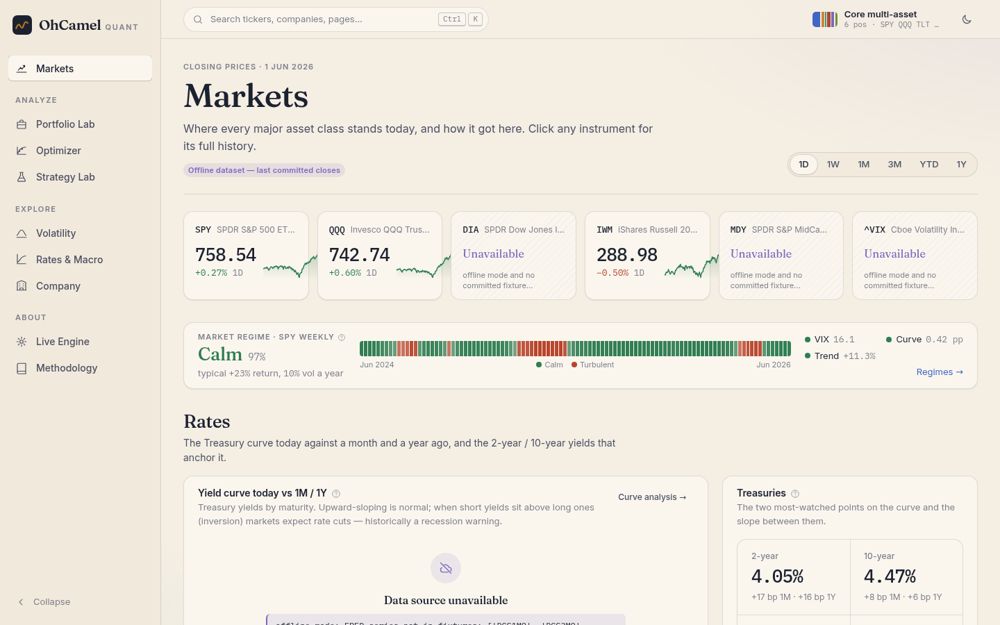
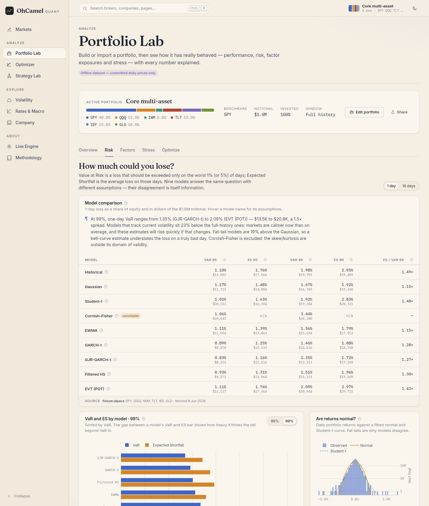

# OhCamel

[](https://github.com/ajaiupadhyaya/OhCamel/actions/workflows/ci.yml)

**A real-data quantitative finance workstation.** Build a portfolio from real
tickers (or import a real fund's latest 13F filing), then measure its risk
with eight VaR/ES models and backtest them. You can also decompose it into
factors, stress it through seventeen historical crises, optimize it with ten
published methods, test literature trading strategies with overfitting
diagnostics, read the options market's implied volatility surface, and put it
all in the context of the rates and macro cycle.

**Live:** [ohcamel.ajaiupadhyaya.com](https://ohcamel.ajaiupadhyaya.com)



Every number on the site comes from a real data source, and every payload
carries its **provenance** (source, fetch time, `synthetic: false`) plus any
caveats. There are no simulated markets, no placeholder figures, and no
hard-coded market inputs. The risk-free rate comes from FRED, the equity risk
premium from Kenneth French's data library, option-implied rates and dividends
from put–call parity on the live chain, and company fundamentals from SEC
XBRL filings. When a source is unreachable, the page says so and shows
nothing, rather than an approximation.

The repository has two parts:

| | What it is | Where |
|---|---|---|
| **OhCamel Quant** | The platform above: a FastAPI analytics service (Python, ~20k lines, 600 tests) and a React app. It is the public site. | [`quant/`](quant/) |
| **The engine** | A real-time risk and limits engine in OCaml on Jane Street's Incremental. Risk is a dependency graph, so a tick recomputes only what depends on it. It is driven by Alpaca's live feed and runs a paper-trading desk behind a password. | [`lib/`](lib/), [`desk/`](desk/), [`docs/engine.md`](docs/engine.md) |

---

## What you can do

### Markets
Where every major asset class stands today and how it got there: US indices,
the eleven S&P sectors as a heatmap, style factors, the Treasury curve now vs
1 month and 1 year ago, credit, international equity, commodities, crypto and
VIX. The page also has a market-regime strip and a cross-asset correlation
matrix. Every instrument opens a ticker page with its price history, drawdowns,
realized volatility, return distribution and monthly returns.

### Portfolio Lab
Enter tickers and weights, pick a named universe, paste a CSV, or **import the
latest 13F holdings** of Berkshire Hathaway, Bridgewater, Renaissance,
Pershing Square, Scion or Appaloosa from SEC EDGAR. You get five tabs:

| Tab | Contents |
|---|---|
| **Overview** | Growth vs benchmark and CAGR. Sharpe with its Lo (2002) standard error, Sortino, Calmar, Omega. Drawdown episodes and a monthly returns grid. Rolling Sharpe, volatility and beta. Alpha/beta, information ratio, capture ratios, M². The Probabilistic Sharpe Ratio and minimum track-record length. |
| **Risk** | VaR and ES at 95% and 99% under eight models, side by side: historical, Gaussian, Student-t, Cornish–Fisher, EWMA, GARCH-t, GJR-GARCH-t, filtered historical simulation and EVT peaks-over-threshold. Each is backtested out of sample with the Kupiec, Christoffersen, Engle–Manganelli and Acerbi–Szekely tests and the Basel traffic light. Also an Euler decomposition of VaR and ES by position, incremental VaR, and GARCH volatility forecasts. |
| **Factors** | Fama–French 3/5-factor and Carhart regressions with Newey–West t-stats, rolling betas, a systematic vs idiosyncratic risk split, and cumulative return attribution. If Ken French's server is down, it falls back to tradable ETF factors. |
| **Stress** | Seventeen real crises replayed on your actual holdings, from Black Monday 1987, LTCM, the dot-com bust and the GFC to COVID, the 2022 bear market, SVB and the August 2024 yen-carry unwind. Also conditional "what if SPY falls 10%" shocks propagated through the estimated covariance (Kupiec 1998). |
| **Optimize** | Your capital share against your risk share, with a one-click hand-off to the Optimizer. |



### Optimizer
Minimum variance, max Sharpe (convex tangency), mean–variance targets, equal
risk contribution, hierarchical risk parity, HERC, maximum diversification,
minimum CVaR (LP) and Black–Litterman with your own views. Each runs on sample,
EWMA, Ledoit–Wolf or OAS covariance, optionally denoised with random-matrix
theory. You get the efficient frontier with the capital market line, a
covariance explorer showing the eigenvalue spectrum against Marchenko–Pastur
bounds, and a **walk-forward out-of-sample comparison of every method against
1/N**, with a robust Sharpe-difference test.

### Strategy Lab
A dozen published strategies, each with its paper: time-series momentum
(Moskowitz–Ooi–Pedersen), cross-sectional momentum (Jegadeesh–Titman), dual
momentum, Faber's trend rule, volatility-managed portfolios (Moreira–Muir,
real-time version), risk parity with a vol target, betting-against-beta, short-term
reversal, and distance and cointegration pairs trading. The engine executes
with a lag, so there is no look-ahead. It includes transaction costs, borrow
costs and cash earning the T-bill rate. The **overfitting guardrails** are
parameter sweeps, the Probability of Backtest Overfitting (CSCV), the Deflated
Sharpe Ratio, Hansen's SPA test, a stationary-bootstrap Sharpe interval,
walk-forward optimization and cost-sensitivity curves.

### Volatility
The listed options chain from Cboe gives:

- implied forward, rate and dividend yield per expiry from put–call parity;
- our own implied vols against the vendor's;
- SVI smiles and a 3-D surface, with no-butterfly and calendar-arbitrage checks;
- a VIX-methodology model-free implied vol for any underlying, 25Δ risk reversals and butterflies;
- the risk-neutral density (Breeden–Litzenberger) with implied probabilities of a move;
- a multi-leg strategy builder on real quotes;
- five realized-vol estimators, the volatility cone and the volatility risk premium.

### Rates & Macro
- A dashboard of 26 FRED indicators, each with its 10-year percentile.
- The Treasury par curve bootstrapped to zero and forward curves, with Nelson–Siegel and Svensson fits.
- PCA of curve moves (level, slope, curvature).
- An Estrella–Mishkin recession probit fitted on NBER dates, and the Sahm rule.
- Hamilton Markov-switching regimes.
- Taylor-rule policy rates against actual fed funds.
- A bond calculator with key-rate durations and Z-spread.
- A FRED explorer.

### Company
Standardized statements from SEC XBRL, ratios and DuPont analysis, and quality
scores: Piotroski F, Altman Z/Z″, Beneish M and Sloan accruals. There is also
a two-stage FCFF DCF whose inputs all come from data:

- the risk-free rate from FRED;
- beta from 60 months of returns;
- the ERP from the French library;
- the tax rate and cost of debt from the filings;
- terminal growth from 10-year breakeven inflation.

It adds a WACC × growth sensitivity grid and a reverse DCF that solves for the
growth the price implies.

### Methodology
Every model on the site with a plain-English summary, its formulas, its
assumptions and its citation. It also has a bibliography, the data sources and
their refresh cadence, and an honest list of limitations.

---

## Data sources

| Source | Supplies | Notes |
|---|---|---|
| [Alpaca](https://alpaca.markets/docs/api-references/market-data-api/) | Daily bars and snapshots for US equities and ETFs | Used first when keys are present. Split- and dividend-adjusted. |
| Yahoo Finance chart API | Long daily history (to 1990), indices (`^VIX`), crypto, FX | Adjusted closes. |
| Stooq | Last-resort daily bars | Unadjusted, and stated as such. |
| [FRED](https://fred.stlouisfed.org) | Treasury curve, T-bills, inflation, labor, credit spreads, NFCI, USREC, GDP and potential GDP… | Public CSV endpoint; an API key is optional. |
| [Kenneth French Data Library](https://mba.tuck.dartmouth.edu/pages/faculty/ken.french/data_library.html) | Daily FF3/FF5 factors, momentum, RF | Cached weekly. |
| Cboe delayed quotes | Full listed options chains | Cached for 15 minutes. |
| SEC EDGAR | XBRL company facts, 13F-HR information tables, ticker↔CIK | Fair-access rate limits and a contact user-agent. |
| OpenFIGI | CUSIP → ticker for 13F holdings | Mappings cached permanently. |

Fetched data is cached as Parquet with a JSON provenance sidecar. If a refresh
fails, the last good copy is served and labelled stale. The committed real
datasets in [`fixtures/`](fixtures/) (ten years of Alpaca ETF bars and FRED
yields) back the offline test suite and serve as the last-resort source.

## Architecture

```
            ┌──────────────────────── React app (quant/web) ────────────────────────┐
browser ──▶ │ Markets · Portfolio Lab · Optimizer · Strategy Lab · Volatility ·      │
            │ Rates & Macro · Company · Live Engine · Methodology                    │
            └───────────────────────────────┬───────────────────────────────────────┘
                                            │ /api (JSON, every payload with provenance)
            ┌───────────────── FastAPI (quant/src/ohcamel_quant) ───────────────────┐
            │ routers ─▶ pure analytics: risk · portfolio · factors · backtest ·     │
            │            options · macro · fundamentals   (numpy/scipy/statsmodels/  │
            │            arch; no I/O, tested on real fixtures)                      │
            │ MarketData facade ─▶ store (Parquet + provenance, TTL, stale-serve)   │
            │                   ─▶ providers: Alpaca · Yahoo · Stooq · FRED ·        │
            │                      French · Cboe · SEC EDGAR · OpenFIGI              │
            └────────────────────────────────────────────────────────────────────────┘
                   Caddy (TLS) ─ one DigitalOcean droplet ─ OCaml engine (live host)
```

The analytics modules are pure functions over pandas objects and never touch
the network. Only the routers call the `MarketData` facade. That separation
means the maths can be tested against closed forms, textbook examples and ten
years of real data with no network access.

## Running it

```bash
make quant-deps      # uv sync (Python 3.12) + npm ci
make quant-dev       # API on :8090 (offline, committed real data) + Vite on :5173
make quant-test      # ruff + pytest (offline) + web typecheck/build
make quant-serve     # API + built web app on :8090, fetching live data
```

Online mode needs outbound internet. Optional environment variables:

- `APCA_API_KEY_ID` and `APCA_API_SECRET_KEY` (Alpaca)
- `FRED_API_KEY`
- `OHCAMEL_QUANT_USER_AGENT` (a contact string SEC asks for)

Offline mode (`OHCAMEL_QUANT_OFFLINE=1`) serves only the committed real
fixtures. Pages that need other sources say so.

**Deploying** (on the droplet): `deploy/deploy.sh --public-only` builds and
starts Caddy and the Quant service, smoke-tests them, and is safe during
market hours. `deploy/deploy.sh --live` also rebuilds the OCaml live engine
and the research service. See [`deploy/`](deploy/).

**CI** runs, on every push:

- `quant`: lint, the offline tests and the web build;
- `quant-live-data`: the `@live` tests against every real vendor, with a per-source pass/fail table;
- `quant-image`: builds the container and smoke-tests it;
- the OCaml engine's own build and tests.

## The engine

The OCaml engine is the project's first half, and it is still the part to
read to see how real-time risk can be computed without a polling loop. A
price tick sets one input cell of an Incremental graph, and only its
downstream nodes recompute. At 400 names a tick costs about 0.5 ms, against
53 ms to recompute everything. It validates its own VaR with coverage tests on
real crisis windows, and it gates a paper-trading desk's orders against the
book's limits. The full write-up is [`docs/engine.md`](docs/engine.md); the
maths is in [`docs/quant_notes.md`](docs/quant_notes.md).

## License

MIT. See [LICENSE](LICENSE).
