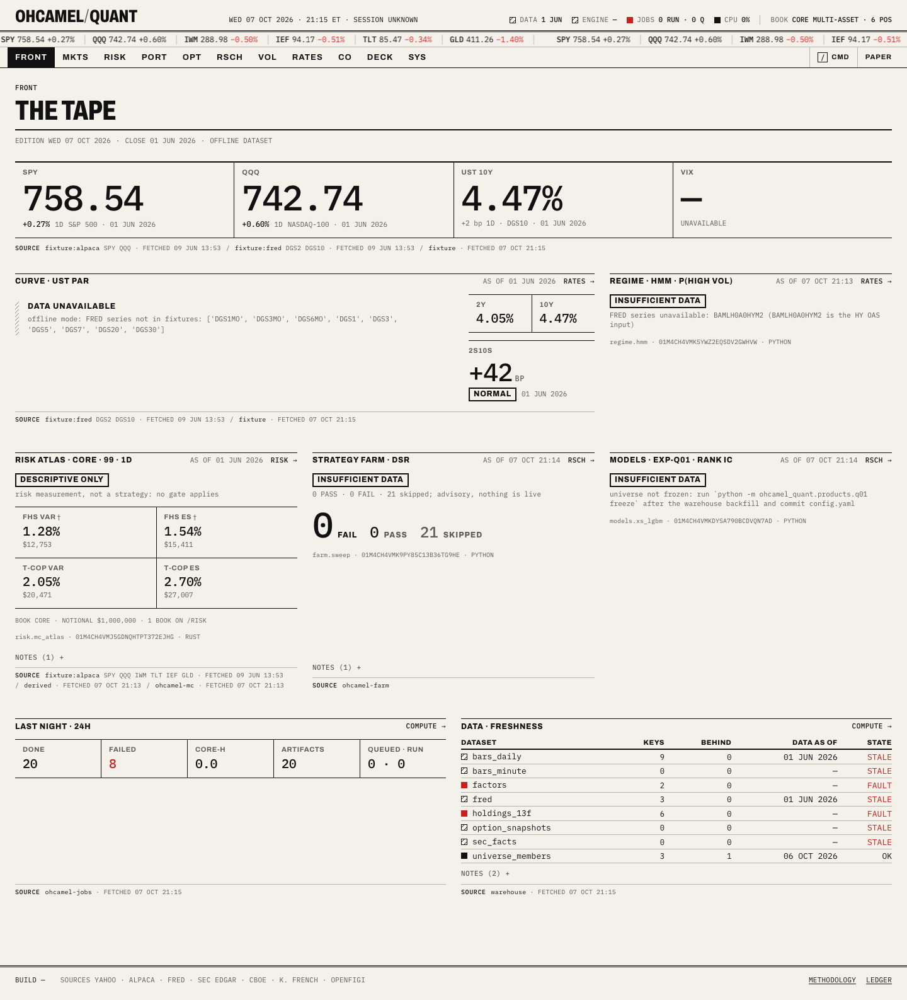
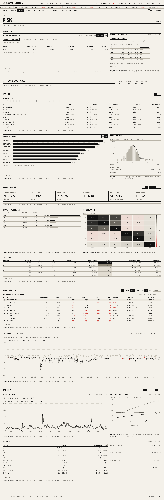

# OhCamel

[](https://github.com/ajaiupadhyaya/OhCamel/actions/workflows/ci.yml)

**OhCamel Quant** is a real-data quantitative finance site and the compute behind it, on one $24/month
droplet. You can measure a portfolio's risk under nine VaR/ES models and backtest them, decompose and stress
it, optimize it, and test published strategies with overfitting diagnostics. You can also read the options
surface and the rates cycle. Scheduled jobs run seven research products overnight. Each product leads with
a verdict, and most of the verdicts are not flattering.

**Live:** [ohcamel.ajaiupadhyaya.com](https://ohcamel.ajaiupadhyaya.com) · what exists, what was cut and what
is only advisory: [`/ledger`](https://ohcamel.ajaiupadhyaya.com/ledger)



Every number comes from a real source, and every payload and artifact carries its **provenance** (source, fetch
time, `data_asof`) and its caveats. When a source is unreachable, the page says so and shows nothing. Nothing is
simulated, filled in or hard-coded. The risk-free rate comes from FRED, the equity premium from Ken French's
library, option-implied rates and dividends from put-call parity on the live chain, and fundamentals from SEC
XBRL.

| | What it is | Where |
|---|---|---|
| **OhCamel Quant** | The public site. A FastAPI service (Python, ~30k lines, <!-- count:quant-tests -->1306<!-- /count --> tests), a React app, a job worker, a DuckDB warehouse, ten Rust kernels and a host telemetry daemon | [`quant/`](quant/), [`native/`](native/) |
| **The engine** | A real-time risk and limits engine in OCaml on Jane Street's Incremental: a tick recomputes only what depends on it. It runs a paper desk behind a password on the live host | [`lib/`](lib/), [`desk/`](desk/), [`docs/engine.md`](docs/engine.md) |

---

## Three tiers on one box

The droplet is `s-2vcpu-4gb`. Docker Compose places each service in a systemd slice, and the CPU weights decide
who yields under contention.

| Tier | Services | Slice and budget | Job |
|---|---|---|---|
| **Protected** | `ohcamel-live` (OCaml engine) | `ohcamel-rt`, weight 4096, 512 MB | The live risk engine and paper desk. It is never starved |
| **Interactive** | Caddy, `ohcamel-quant` (API + site), `ohcamel-hostd` | `ohcamel-web`, weight 1024; API 1 GB | Answers every page synchronously, within caps. Requests over the caps become jobs |
| **Preemptible** | `ohcamel-worker` (jobs), `ohcamel-research` | `ohcamel-batch`, worker weight 128, ≤ 1.75 CPUs, 1280 MB, OOM-killed first | Runs one job at a time from `jobs.sqlite` and publishes immutable artifacts |

The worker only starts a job when hostd's `mem_available` minus a 512 MiB reserve covers the job's memory class
(S 256, M 640, L 1152 MiB). Heavy jobs never start 09:25–16:05 New York on a session day. The worker is also the
warehouse's only writer. Heavy loops (Monte Carlo paths, bootstrap, CSCV, GARCH fits, backtests, SVI, realized
variance) run in Rust via PyO3. Each kernel has a NumPy reference and parity tests, and the production image
refuses to start without the Rust wheel.

## The products

Each runs on a schedule (`quant/src/ohcamel_quant/jobs/schedules.yaml`, New York time). Each writes an artifact
whose first field is its verdict: `PASS`, `FAIL`, `ADVISORY`, `INSUFFICIENT DATA` or `DESCRIPTIVE ONLY`. A
measurement that is not a strategy is `DESCRIPTIVE ONLY` and has no gate to pass. Strategies are held to
[`docs/CHARTER.md`](docs/CHARTER.md)'s gates, applied literally. A metric that cannot be computed fails its
gate. Nothing any product computes reaches the desk.

| | Product | Schedule | Verdict it can reach | Where |
|---|---|---|---|---|
| P1 | **Risk atlas.** 1M-path Monte Carlo VaR/ES per reference book, by FHS (GJR-GARCH-t) and a Student-t copula, at 1D and 10D, with the Euler split of ES. Universe members are measured by FHS alone. Books are re-measured every 15 minutes in session | nightly 20:00; intraday | DESCRIPTIVE ONLY | `/risk`, `/`, `/deck` |
| P2 | **Volatility forecast league.** GARCH, GJR, EGARCH, HAR-RV (minute bars) and EWMA, scored out of sample by QLIKE and MSE, with Diebold–Mariano tests and a model confidence set | nightly 21:30 | DESCRIPTIVE ONLY | `/options` |
| P3 | **Covariance league.** Seven estimators, ranked by the realized volatility of their minimum-variance portfolio, with a HAC test against the sample covariance | Sat 08:00 | DESCRIPTIVE ONLY | `/portfolio` |
| P4 | **Strategy farm.** Every Strategy Lab strategy × universe × a grid of up to 256 parameter sets, selected walk-forward, with DSR counting every trial in the farm, PSR, CSCV PBO, SPA, bootstrap, regimes and costs at 0/5/15/30 bps | nightly 23:00, 90-min budget | PASS / FAIL per row | `/research` |
| P5 | **EXP-Q01.** A LightGBM ETF ranker against a linear composite, with purged walk-forward CV; the 2022→ holdout is evaluated once | monthly, 1st 22:30 | PASS / FAIL, always advisory | `/research` |
| P6 | **EXP-Q02.** A Gaussian HMM on four weekly features. Does the filtered high-volatility probability beat EWMA for next-month SPY variance? | Sat 09:00 | PASS / FAIL, descriptive | `/macro` |
| P7 | **Surface history.** A nightly SVI fit of each option snapshot: ATM IV, 25Δ risk reversal and butterfly, term slope, model-free variance, VRP | nightly 21:00 | DESCRIPTIVE ONLY | `/options` |

**Where they stand, honestly (2026-10-08).** The warehouse backfill on the droplet finished its daily bars on
2026-10-08 (as-of 2026-10-07). P5 reads `INSUFFICIENT DATA · UNIVERSE NOT FROZEN` until its universe is frozen,
once, after that backfill (the procedure is in the [compute runbook](docs/runbooks/compute.md)). P7's history
grows only from the first nightly snapshot, because Cboe history cannot be re-fetched. P6 reads the high-yield
spread from the warehouse's FRED ingest. On the offline fixture warehouse, which lacks that series and has no
option snapshots or frozen universe, P1–P3 return numbers and P4–P7 return `INSUFFICIENT DATA` with their
reasons. The farm's rows are expected to fail mostly, and the page lists the failures first. EXP-Q01 and
EXP-Q02 were pre-registered and approved by the owner on 2026-10-06
([`research/experiments/`](research/experiments/)). A deviation from either is a new experiment. Each product's
live verdict is on its page and on `/ledger`. Methodology for every product and kernel: `/methodology`.

## The site: Paper Tape

The design is a printed risk report: ink on paper, ruled cells, Archivo caps for labels, IBM Plex Mono for every
number, and signal red only for losses, breaches and alerts. There is a carbon (dark) theme too. The Flight Deck
is the one dark room. Every route passes axe with zero serious violations and works at 380px.

| Code | Route | Contents |
|---|---|---|
| FRONT | `/` | Index figures, UST curve and 2s10s, regime probabilities (P6), atlas headline (P1), farm verdict count (P4), model verdict (P5), last night's compute, data freshness |
| MKTS | `/markets` | Indices, the eleven sectors, rates, credit, commodities, volatility, cross-asset correlation |
| RISK | `/risk` | VaR/ES under nine models (historical, Gaussian, Student-t, Cornish-Fisher, EWMA, GARCH, GJR, FHS, EVT), with Kupiec/Christoffersen/Acerbi–Szekely backtests and the Basel light; Euler and incremental VaR; the atlas (P1) |
| PORT | `/portfolio` | Holdings (tickers, CSV, named universes, the latest 13F of six funds), performance with PSR, Fama–French regressions, 17 historical crises and conditional shocks, the covariance league (P3) |
| OPT | `/optimize` | Ten methods (min variance to HRP, HERC and min-CVaR) plus Black–Litterman, on four covariance estimators with optional denoising; the frontier; walk-forward against 1/N |
| RSCH | `/research` | Twelve strategies (ten from the literature, two benchmarks) with PBO, DSR, SPA, bootstrap, walk-forward and cost curves; the farm (P4); the model (P5) |
| VOL | `/options` | The Cboe chain: parity forwards, own IVs, SVI smiles and surface with arbitrage checks, model-free IV, risk-neutral density, a strategy builder, five realized-vol estimators; P2, P7 |
| RATES | `/macro` | 26 FRED indicators with percentiles, bootstrapped zero and forward curves, NS/NSS, curve PCA, recession probit, Sahm rule, Taylor rules, regimes (P6), a bond calculator |
| CO | `/company/:ticker` | SEC XBRL statements, ratios, Piotroski/Altman/Beneish/Sloan, a data-driven FCFF DCF and reverse DCF |
| DECK | `/deck` | The Flight Deck: reference books' limits, risk and feeds as instruments, plus a compute bank |
| SYS | `/system` | Index of `/compute` (hostd, queue, schedule, kernel benchmarks), `/engine`, `/methodology`, `/ledger` |



## Data sources

| Source | Supplies |
|---|---|
| Alpaca | Daily bars (used first when keys are present); IEX 1-minute bars for 50 names |
| Yahoo Finance chart API | Long daily history, indices (`^VIX`), crypto, FX |
| Stooq | Last-resort daily bars, unadjusted and labelled as such |
| FRED | Treasury curve, bills, inflation, labour, credit spreads, recession dates |
| Kenneth French Data Library | Daily FF3/FF5, momentum, RF |
| Cboe delayed quotes | Full listed option chains; 30 underlyings snapshotted nightly |
| SEC EDGAR | XBRL company facts, 13F-HR holdings |
| OpenFIGI | CUSIP → ticker for 13F holdings |

Interactive reads are cached as Parquet with a provenance sidecar. When a refresh fails, the last good copy is
served and labelled stale. The warehouse (`warehouse.duckdb`) holds the scheduled ingests and is read first. The
committed real datasets in [`fixtures/`](fixtures/) back the offline tests and are the last resort.
Universes are current constituents, so delisted names are absent (survivorship). This is stated on every
product that uses them.

## Running it locally

```bash
make quant-deps      # uv sync (Python 3.12) + npm ci
make kernels-dev     # build the Rust kernels wheel into quant/.venv (rustup; optional: NumPy references otherwise)
make quant-dev       # API on :8090 offline (committed real data) + Vite on :5173
make quant-test      # ruff + the offline pytest suite
make quant-serve     # the built app on :8090, fetching live data
```

Optional environment variables: `APCA_API_KEY_ID` / `APCA_API_SECRET_KEY` (Alpaca), `FRED_API_KEY`, and
`OHCAMEL_QUANT_USER_AGENT` (the contact string SEC asks for). `OHCAMEL_QUANT_OFFLINE=1` serves only the committed
fixtures. `OHCAMEL_QUANT_KERNELS=python` forces the NumPy references. Pages that need other sources say so.
`quant/README.md` is the code map. `quant/web/src/README.md` is the page-author guide.

## How it deploys

On every push, CI runs the OCaml build and tests, the Rust kernels' parity in both directions, the quant lint
and offline suite (plus `scripts/check-counts.sh --verify`), the web typecheck, tests and build with its bundle
rule, the `@live` vendor tests, and the deploy-script tests. The image workflow publishes four images per commit
(`ohcamel`, `ohcamel-research`, `ohcamel-quant`, `ohcamel-hostd`). The droplet builds nothing.

`deploy/deploy.sh --sha <sha> --public-only`, run on the droplet, checks the sha out and waits for its images.
It restarts Caddy, the API, the worker and hostd, then smoke-tests the result against the sha. It is safe during
market hours. `--live` also restarts the engine and the research service, after a backup of the desk journal,
and it is refused inside the market window. Rollback is the same command with the previous good sha from
`~/deploys.log`. Runbooks: [`docs/status.md`](docs/status.md#operating-it) (deploy, rollback, backups, watch,
recovery) and [`docs/runbooks/compute.md`](docs/runbooks/compute.md) (hostd, the queue, schedules, backfill,
the Q01 freeze, restoring `jobs.sqlite` and the warehouse). What is deployed where:
[`docs/status.md`](docs/status.md#where-it-runs).

## The engine

The OCaml engine is the project's first half. Read it to see how real-time risk works without a polling loop. A
price tick sets one input cell of an Incremental graph, and only that cell's downstream nodes recompute. At 400
names a tick costs about 0.5 ms, against 53 ms to recompute everything. It validates its own VaR with coverage
tests on real crisis windows, and it gates a paper desk's orders against the book's limits. The full write-up is
[`docs/engine.md`](docs/engine.md); the maths is in [`docs/quant_notes.md`](docs/quant_notes.md).

## License

MIT. See [LICENSE](LICENSE).
